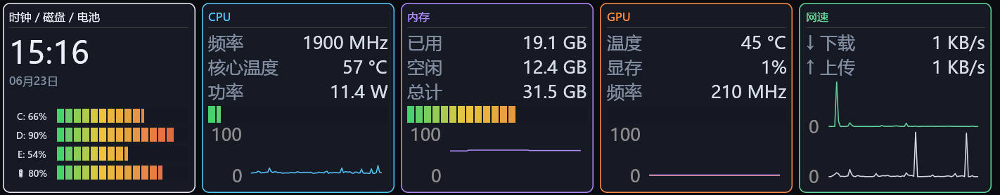

# hud-cli

一个**纯 Rust** 的 Windows 终端系统仪表盘 —— 不依赖 Rainmeter / HWiNFO。
CPU 占用/频率、内存、网速、电池、NVIDIA GPU（温度/占用/显存/频率）直接读取；
CPU 温度通过 `cpu-temp` crate 的 **PawnIO 内核驱动**读取（和 LibreHardwareMonitor 同源原理，需要管理员）。

## 构建

```powershell
cd lenovo-magicbay-hud
cargo build --release        # 产出 target\release\hud-cli.exe
```

## 运行

```powershell
hud-cli              # 实时 TUI 仪表盘（按 q 或 Esc 退出）
hud-cli --once       # 采集一次并打印，不进 TUI（快速自检）
```

##  效果


### CPU 温度 / 功率（需要装 PawnIO 驱动 + 管理员）

CPU 温度、封装功率在 Windows 用户态读不到，本项目用 `cpu-temp` crate 通过 **PawnIO** 内核驱动
读 CPU 的 MSR（温度 MSR + RAPL 能耗 MSR 算功率）。已内置尝试，无需参数：
1. 安装 PawnIO 驱动（开源，见 https://github.com/PawnIO ，按其说明以管理员安装）。
2. 以管理员运行 `hud-cli`（CPU 卡显示核心温度 + 功率 + 占用折线图）。

- 没装 PawnIO / 没用管理员：CPU 温度和功率显示 `N/A`，其余指标正常；TUI 模式下已自动屏蔽
  驱动加载的刷屏信息，界面不会乱。
- 装了 PawnIO、用了管理员仍 N/A：多半是「内核隔离 / 内存完整性(HVCI)」拦了驱动。

> Windows 上"纯零安装"读 CPU 温度基本做不到 —— 必须有能读 MSR 的内核驱动（PawnIO/WinRing0 等），
> WinRing0 又常被 HVCI 拦。要 CPU 温度又零折腾，原来的 Rainmeter + HWiNFO 皮肤仍是最省事的。

## 数据来源（无需安装任何软件）

| 指标 | 来源 | 依赖 |
|---|---|---|
| CPU 占用、频率 | Win32 | `sysinfo` |
| 内存 已用/总量 | Win32 | `sysinfo` |
| 网速 ↓/↑ | Win32 | `sysinfo` |
| 电池 % | `GetSystemPowerStatus` | `windows` |
| 时钟 | 系统时间 | `chrono` |
| GPU 温度/占用/显存/频率 | NVML | `nvml-wrapper`（`nvml.dll` 随 NVIDIA 驱动自带） |
| **CPU 温度 / 功率** | CPU MSR（温度 + RAPL 能耗） | `cpu-temp` + **PawnIO 驱动（需管理员）** |

## 文件结构

```
src/
  main.rs       入口；--once 模式；TUI 事件循环；退出时恢复终端
  sensors.rs    SensorSnapshot + Sensors::poll()（汇集所有传感器）
  ui.rs         ratatui 四卡片仪表盘 + 进度条 + 网络栏
  theme.rs      配色（对应 Rainmeter 皮肤 MagicBayHUD-HWiNFO）
```

## 已知限制（MVP）

- CPU 温度需管理员 + PawnIO 驱动（见上）。
- GPU 仅支持 NVIDIA（NVML）；AMD/Intel 需另接库。
- 终端渲染为字符栅格（非像素），和 Rainmeter 的像素级外观不同。
- CPU 频率为基础频率档位（非实时 turbo 精确值）。
